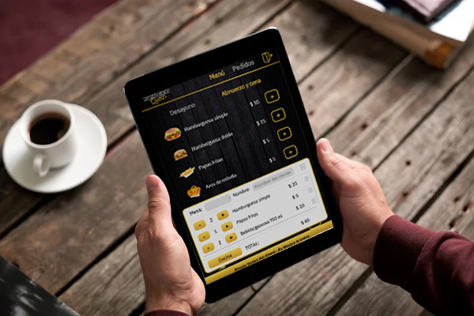
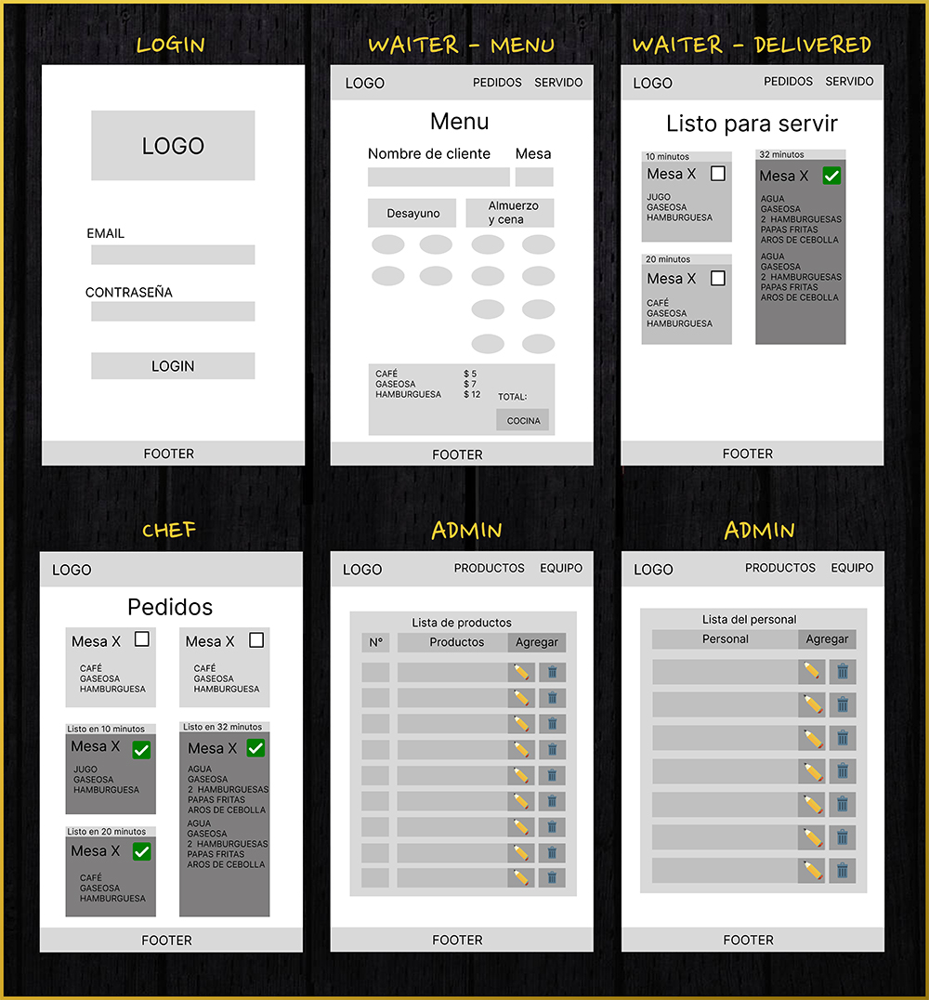

# Burger Queen ♛

## Índice

* [1. Preámbulo](#1-preámbulo)
* [2. Resumen del proyecto](#2-resumen-del-proyecto)
* [3. Historias de usuarios](#3-historias-de-usuarios)
* [4. Prototipo de baja fidelidad](#4-prototipo-de-baja-fidelidad)
* [5. Prototipo de alta fidelidad](#5-prototipo-de-alta-fidelidad)

***

## 1. Preámbulo

[Angular](https://angular.io/) es uno de los _frameworks_ de JavaScript más utilizados por
lxs desarrolladorxs alrededor del mundo, y hay una razón para eso.
En el contexto del navegador, [_mantener la interfaz sincronizada con el estado
es difícil_](https://medium.com/dailyjs/the-deepest-reason-why-modern-javascript-frameworks-exist-933b86ebc445).
Al elegir un _framework_ para nuestra interfaz, nos apoyamos en una
serie de convenciones e implementaciones _probadas_ y _documentadas_ para
resolver un problema común a toda interfaz web. Esto nos permite concentrarnos
mejor (dedicar más tiempo) en las características _específicas_ de
nuestra aplicación.

Cuando elegimos esta tecnología no solo importamos un pedacito de
código para reusarlo (lo cuál es un gran valor per se), si no que adoptamos una
**arquitectura**, una serie de **principios de diseño**, un **paradigma**, unas
**abstracciones**, un **vocabulario**, una **comunidad**, etc.

## 2. Resumen del proyecto

Un pequeño restaurante de hamburguesas, que está creciendo, necesita un
sistema a través del cual puedan tomar pedidos usando una _tablet_, y enviarlos
a la cocina para que se preparen ordenada y eficientemente.

Este proyecto tiene dos áreas: interfaz (cliente) y API (servidor). Nuestra
clienta nos ha solicitado desarrollar la interfaz que se integre con una API.

Esta es la información que tenemos de la clienta:

> Somos **Burguer Queen**, una cadena de comida 24hrs.
>
> Nuestra propuesta de servicio 24hrs ha tenido muy buena acogida y, para
> seguir creciendo, necesitamos un sistema que nos ayude a tomar los pedidos de
> nuestrxs clientxs.
>
> Tenemos 2 menús: uno muy sencillo para el desayuno:
>
> | Ítem                      |Precio|
> |---------------------------|------|
> | Café americano            |    5 |
> | Café con leche            |    7 |
> | Sandwich de jamón y queso |   10 |
> | Jugo de frutas natural    |    7 |
> | Chicha morada             |    5 |
> | Papa rellena              |   10 |
> | Tamal                     |   10 |
> | Panqueques                |   15 |
> | Tapioca brasilera         |   10 |
> | Onigiri                   |   10 |
> | 

> Y otro menú para el resto del día:
>
> | Ítem                      |Precio|
> |---------------------------|------|
> |Hamburguesa simple         |    10|
> |Hamburguesa doble          |    15|
> |Salchipapa                 |    15|
> |Tteokbokki                 |    15| 
> |Ramen                      |    20|
> |Pizza                      |    20|
> |Papas fritas               |     5|
> |Aros de cebolla            |     5|
> |Agua 500ml                 |     5|
> |Agua 750ml                 |     7|
> |Bebida/gaseosa 500ml       |     7|
> |Bebida/gaseosa 750ml       |    10|
> |Matcha latte               |     7|
>

### Consideraciones generales

* `IMPORTANTE`, para mayor recorrido satisfactorio a través del proyecto, te sugerimos cambiar la pantalla a vista de tablet en modo `Vertical` , de preferencia `Ipad PRO 11`, que cuenta con las medidas: `834 x 1194`.
* La aplicación trabaja con [API MOCK](https://bqac-4.onrender.com/), por lo que te sugerimos que cuentes con buena conexión de internet, de no ser asi, ser paciente hasta que los procesos(ejemplo: enviar órdenes, renderizar las listas en admin, etc) finalicen exitosamente, tomará solo unos segundos dependiento tu señal de internet.
* El diseño de la aplicación fue mejorado múltiples veces gracias a los test de usabilidad, culminando en la versión número tres, la cual fue construída con Angular 16 y Typescript.
* Los colores base para el proyecto fueron: negro, dorado y tonos de gris.
* La aplicación permite agregar, editar y eliminar personal o lista de productos del menú , el único usuario permitido para estas acciones, es el que tenga el rol de Administrador al loguearse a la aplicación.
* La aplicación permite crear pedidos y enviarlos a una base de datos, que permita al chef ver los pedidos para prepararlos y a su vez, enviar los pedidos que están listos para ser servidos a mesa por el mesero.
* La aplicación permite al mesero saber que pedidos ya están listos para servir y marcar los que ya entregó.
* La aplicación cuenta con una protección de rutas, por lo que el administrador es el único capaz de entrar a todas las vistas disponibles, tanto el mesero como el cocinero solo tienen acceso a sus propias vistas.
* Las funcionalidades fueron testeadas con Karma y Jasmine.
* Se diseñó solo para el uso de tablets, usando como base el Ipad PRO 11.

## 3. Historias de usuarios:
#### [Historia de usuario 1] Mesero/a debe poder ingresar al sistema, si el admin ya le ha asignado credenciales

Yo como meserx quiero poder ingresar al sistema de pedidos.

##### Criterios de aceptación

Lo que debe ocurrir para que se satisfagan las necesidades del usuario.

* Acceder a una pantalla de login.
* Ingresar email y contraseña.
* Recibir mensajes de error comprensibles, dependiendo de cuál es el error
  con la información ingresada.
* Ingresar al sistema de pedidos si las crendenciales son correctas.

##### Definición de terminado

Lo acordado que debe ocurrir para decir que la historia está terminada.

* Debes haber recibido _code review_ de al menos una compañera.
* Haces _test_ unitarios y, además, has testeado tu producto manualmente.
* Hiciste _tests_ de usabilidad e incorporaste el _feedback_ del usuario.
* Desplegaste tu aplicación y has etiquetado tu versión (git tag).

***

#### [Historia de usuario 2] Mesero/a debe poder tomar pedido de cliente/a

Yo como meserx quiero tomar el pedido de unx clientx para no depender de mi mala
memoria, para saber cuánto cobrar, y enviarlo a la cocina para evitar errores y
que se puedan ir preparando en orden.

##### Criterios de aceptación

Lo que debe ocurrir para que se satisfagan las necesidades del usuario

* Anotar nombre de clientx.
* Agregar productos al pedido.
* Eliminar productos.
* Ver resumen y el total de la compra.
* Enviar pedido a cocina (guardar en alguna base de datos).
* Se ve y funciona bien en una _tablet_

##### Definición de terminado

Lo acordado que debe ocurrir para decir que la historia está terminada.

* Debes haber recibido _code review_ de al menos una compañera.
* Haces _test_ unitarios y, además, has testeado tu producto manualmente.
* Hiciste _tests_ de usabilidad e incorporaste el _feedback_ del usuario.
* Desplegaste tu aplicación y has etiquetado tu versión (git tag).

***

#### [Historia de usuario 3] Jefe de cocina debe ver los pedidos

Yo como jefx de cocina quiero ver los pedidos de lxs clientxs en orden y
marcar cuáles están listos para saber qué se debe cocinar y avisar a lxs meserxs
que un pedido está listo para servirlo a un clientx.

##### Criterios de aceptación

* Ver los pedidos ordenados según se van haciendo.
* Marcar los pedidos que se han preparado y están listos para servirse.
* Ver el tiempo que tomó prepara el pedido desde que llegó hasta que se
  marcó como completado.

##### Definición de terminado

* Debes haber recibido _code review_ de al menos una compañera.
* Haces _test_ unitarios y, además, has testeado tu producto manualmente.
* Hiciste _tests_ de usabilidad e incorporaste el _feedback_ del usuario.
* Desplegaste tu aplicación y has etiquetado tu versión (git tag).

***

#### [Historia de usuario 4] Meserx debe ver pedidos listos para servir

Yo como meserx quiero ver los pedidos que están preparados para entregarlos
rápidamente a lxs clientxs que las hicieron.

##### Criterios de aceptación

* Ver listado de pedido listos para servir.
* Marcar pedidos que han sido entregados.

##### Definición de terminado

* Debes haber recibido _code review_ de al menos una compañera.
* Haces _test_ unitarios y, además, has testeado tu producto manualmente.
* Hiciste _tests_ de usabilidad e incorporaste el _feedback_ del usuario.
* Desplegaste tu aplicación y has etiquetado tu versión (git tag).
* Los datos se deben mantener íntegros, incluso después de que un pedido ha
  terminado. Todo esto para poder tener estadísticas en el futuro.

***

#### [Historia de usuario 5] Administrador(a) de tienda debe administrar a sus trabajadorxs

Yo como administrador(a) de tienda quiero gestionar a los usuarios de
la plataforma para mantener actualizado la informacion de mis trabajadorxs.

##### Criterios de aceptación

* Ver listado de trabajadorxs.
* Agregar trabajadorxs.
* Eliminar trabajadoxs.
* Actualizar datos de trabajadorxs.

##### Definición de terminado

* Debes haber recibido _code review_ de al menos una compañera.
* Haces _test_ unitarios y, además, has testeado tu producto manualmente.
* Hiciste _tests_ de usabilidad e incorporaste el _feedback_ del usuario.
* Desplegaste tu aplicación y has etiquetado tu versión (git tag).

***

#### [Historia de usuario 6] Administrador(a) de tienda debe administrar a sus productos

Yo como administrador(a) de tienda quiero gestionar los productos
para mantener actualizado el menú.

##### Criterios de aceptación

* Ver listado de productos.
* Agregar productos.
* Eliminar productos.
* Actualizar datos de productos.

##### Definición de terminado

* Debes haber recibido _code review_ de al menos una compañera.
* Haces _test_ unitarios y, además, has testeado tu producto manualmente.
* Hiciste _tests_ de usabilidad e incorporaste el _feedback_ del usuario.
* Desplegaste tu aplicación y has etiquetado tu versión (git tag).

***

## 4. Prototipo de baja fidelidad:

## 5. Prototipo de alta fidelidad: 

